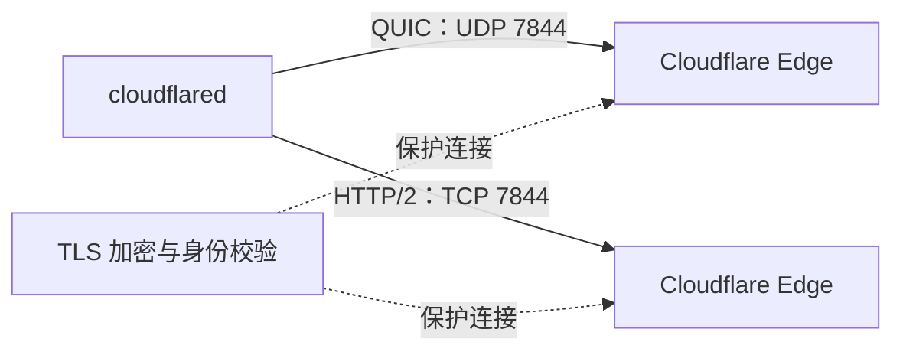
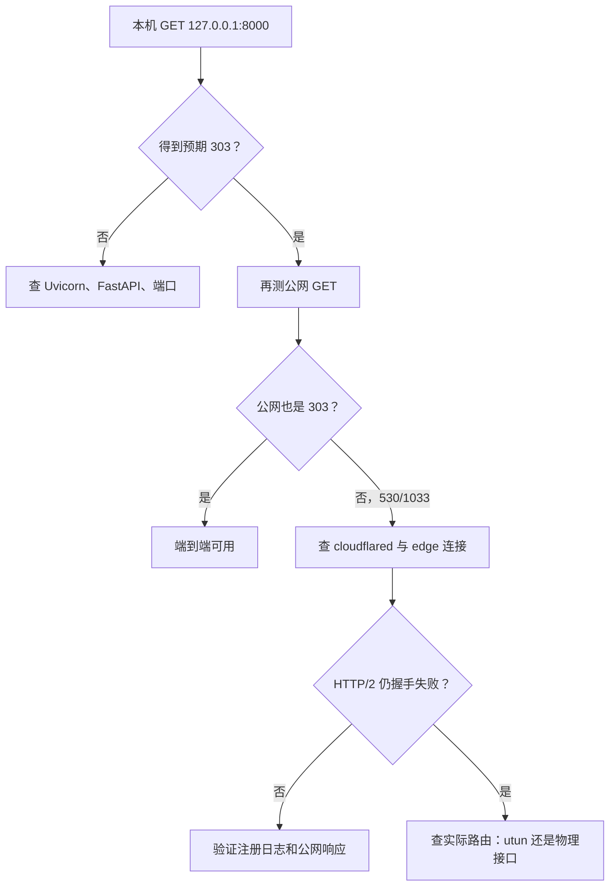
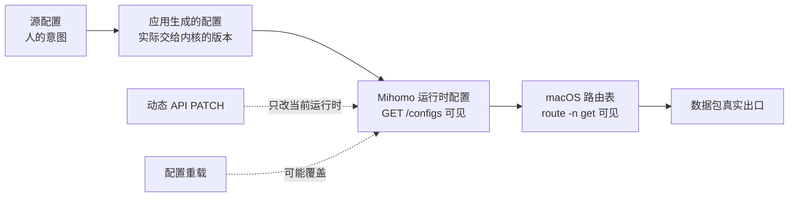

# Knowledge Site 网络故障：一个剥洋葱式心智模型

> 目标不是背诵网络术语，而是能用最少的概念回答两个问题：**请求走到哪里了？它在哪一段停下了？**

这篇文章采用一种费曼式方法：如果一个概念不能用日常语言说清楚，就先不急着给它叠加更多术语。再用奥卡姆剃刀约束排查：**能由更短的故障链解释证据时，不引入更远、更复杂的原因。**

本文解释的是一次真实故障的推理过程，不替代日常操作手册。需要实际启动、停止或恢复服务时，以 [Knowledge Site 当前部署运行手册](../operations/knowledge-site-deployment.md) 为准。

## 先只记住一件事

公网网站要工作，必须同时满足：

1. **Uvicorn 能替 FastAPI 回答本机请求**；
2. **cloudflared 能把这台 Mac 接到 Cloudflare。**


把它想成一家在小巷里的餐馆：

| 现实世界 | 本项目 |
| --- | --- |
| 顾客 | 浏览器 |
| 商场总服务台 | Cloudflare Edge |
| 商场到餐馆的内部专线 | Cloudflare Tunnel |
| 专线驻店设备 | `cloudflared` |
| 餐馆前台 | Uvicorn |
| 厨房和菜单规则 | FastAPI 应用 |

餐馆前台正常，不代表商场专线正常；专线正常，也不代表厨房能出菜。排查的第一原则就是把这两件事分开测。

## 剥洋葱的方法

每一层只回答一个问题。上一层已有反例，就不要急着钻进下一层。

| 层 | 要回答的问题 | 最小证据 |
| --- | --- | --- |
| 1. HTTP 现象 | 对方到底回答了什么？ | 状态码与跳转地址 |
| 2. 本机应用 | Uvicorn/FastAPI 能否回答？ | 本机 `GET` 与端口 listener |
| 3. 进程管理 | 正确的进程是否被正确管理？ | LaunchAgent、PID、参数、日志 |
| 4. Tunnel | connector 是否连上 Cloudflare？ | 注册连接日志与公网响应 |
| 5. 传输协议 | 它尝试走 UDP 还是 TCP？ | QUIC/HTTP/2 日志与 7844 连通性 |
| 6. 本机路由 | 数据包实际从哪个接口出去？ | 路由表中的 `interface` 与 `gateway` |

奥卡姆剃刀在这里不是“永远选择最简单的答案”，而是：**先做能最大幅度切开故障空间的最小实验。** 例如一次本机 `curl`，就能把“应用坏了”和“公网链路坏了”分开。

## 第一层：HTTP 是一张回执

HTTP 请求像寄出一封挂号信，状态码就是回执。它不直接告诉你全部原因，但能告诉你是谁接到了信、下一步往哪查。

| 术语 | 生活类比 | 准确定义 | 本项目中的角色 / 如何观察 |
| --- | --- | --- | --- |
| HTTP | 顾客与前台约定的问答格式 | 请求与响应协议；响应包含状态码、响应头和可选正文 | 用 `curl` 发 `GET`，观察状态码和跳转地址 |
| `303 See Other` | 前台说“请去登录窗口” | 服务器要求客户端用 `GET` 访问另一个 URI | 未登录访问 `/` 时跳转到 `/login?next=/`；这是预期应用响应 |
| `530` | 商场服务台给出的故障回执 | 此处是 Cloudflare 返回的 HTTP 状态，不是 FastAPI 的业务响应 | 故障时公网请求得到 `530`，而本机仍是 `303` |
| `1033` | 回执正文写着“内部专线没人接” | Cloudflare 的 Tunnel 错误码；表示找不到健康的 `cloudflared` 实例接收流量 | 出现在 Cloudflare 错误页正文中；官方说明见 [Error 1033](https://developers.cloudflare.com/support/troubleshooting/http-status-codes/cloudflare-1xxx-errors/error-1033/) |

### 为什么 `303` 是好消息

`303` 不是“页面最终显示成功”，但它证明了更关键的事情：

| 已被证明 | 尚未被证明 |
| --- | --- |
| TCP 连接到了 Uvicorn | 登录密码是否正确 |
| FastAPI 的 `/` route 执行了 | 登录后的每个页面都无缺陷 |
| 认证逻辑生成了跳转 | 公网 Tunnel 一定健康 |

因此，本机 `303` 加公网 `530/1033` 已经足够把问题缩到 **公网链路：Cloudflare Edge、Tunnel connector，以及 connector 到 Edge 的出站连接**。没有证据要求我们先改应用代码或重启 Uvicorn。

> 小心：Cloudflare 的 `530` 是 HTTP 响应状态，`1033` 是错误页中的 Cloudflare 专用码。它们是同一次失败的两种表达，不是两个独立故障。

## 第二层：FastAPI、Uvicorn 与端口

FastAPI 像菜谱和厨房规则；Uvicorn 像真正站在窗口接单的人。菜谱本身不会监听网络端口。

| 术语 | 生活类比 | 准确定义 | 本项目中的角色 / 如何观察 |
| --- | --- | --- | --- |
| FastAPI | 菜谱、厨房流程 | 定义 Python Web route、认证和响应行为的应用框架 | 决定 `/` 未登录时返回 `303` |
| Uvicorn | 接单前台 | 运行 ASGI 应用的服务器进程 | 监听 `127.0.0.1:8000`，把请求交给 FastAPI |
| `localhost` | “这栋楼里” | 指当前机器自身的主机名概念 | 本机诊断时不经过公网 |
| `127.0.0.1` | 楼内专用走廊 | IPv4 loopback 地址，只在本机内通信 | Tunnel 的 origin 地址位于这里 |
| 端口 `8000` | 前台的分机号 | 同一 IP 上用于区分网络服务的数字标识 | Uvicorn 的监听端口 |
| listener | 有人守着分机 | 已绑定地址和端口、等待新连接的 socket/进程 | 用 `lsof` 确认只有一个 Uvicorn listener |
| origin | 真正出菜的后厨 | CDN、代理或 Tunnel 后方的上游服务 | 对 `cloudflared` 而言是本机 Uvicorn，不是浏览器 |

最小实验是：

```bash
curl -sS -o /dev/null \
  -w 'local %{http_code} %{redirect_url}\n' \
  --max-time 5 http://127.0.0.1:8000/
```

如果它返回预期的 `303`，继续改 FastAPI 就像顾客已经在餐馆前台拿到登录指引，却因为商场电话坏了而去重写菜单——方向不对。

## 第三层：进程不是服务管理器

一个进程只是“此刻在干活的人”；`launchd` 才是安排轮班、在进程退出后重新拉起它的管理员。

| 术语 | 生活类比 | 准确定义 | 本项目中的角色 / 如何观察 |
| --- | --- | --- | --- |
| 进程 | 正在值班的人 | 操作系统中运行中的程序实例 | Uvicorn 和 `cloudflared` 各自是进程 |
| PID | 工牌号 | 当前进程的数字标识；重启后通常变化 | 用精确 `ps` 输出核对进程身份，不能把 PID 当永久名称 |
| `launchd` | 排班主管 | macOS 的系统与用户级服务管理器 | 负责按 plist 启动并维持两个网站进程 |
| LaunchAgent | 当前用户的长期值班安排 | `launchd` 管理的用户会话 job | 网站和 connector 分属两个精确 label |
| plist | 排班表 | 描述可执行文件、参数、日志和保活策略的属性列表 | 修改启动参数后必须让 `launchd` 重新读取 |
| `kickstart` | 让当前班次立刻重上 | 启动 job；加 `-k` 会终止已有实例并重启 | 适合 plist 未变化、只需重启精确 job 的情况 |
| `bootout` / `bootstrap` | 撤下旧排班表 / 重新登记新表 | 卸载 / 加载指定 `launchd` job | plist 内容改变后，用它们重新读取配置 |

这里有两个常见误会：

1. **“进程存在”等于“服务健康”**：不成立。`cloudflared` 可以活着，却没有任何健康 edge 连接。
2. **“重启命令成功”等于“网站恢复”**：不成立。命令只证明管理员接受了指令，最终必须重新检查日志和 HTTP。

macOS 自带的 `man launchctl` 是这些动作在当前系统上的一手说明。排查时使用精确 LaunchAgent label，避免模糊匹配或误伤无关 worker。

## 第四层：Tunnel 是向外拨出的电话

传统发布方式像给餐馆开一扇公网大门；Cloudflare Tunnel 更像餐馆主动拨通商场总机，并保持通话。外部顾客不需要直接知道餐馆的公网地址。

| 术语 | 生活类比 | 准确定义 | 本项目中的角色 / 如何观察 |
| --- | --- | --- | --- |
| Cloudflare Edge | 商场总服务台 | 离访问者较近、接收公网请求的 Cloudflare 节点 | 公网域名先到 Edge，再进入 Tunnel |
| Named Tunnel | 有固定编号的内部专线 | Cloudflare 中持久存在的 Tunnel 配置和 hostname 映射 | 让两个公网入口指向本机 origin |
| connector | 驻店专线设备 | 在私有网络内运行、主动连接 Cloudflare 的 `cloudflared` 实例 | 日志应出现已注册 tunnel connection |
| 出站连接 | 餐馆主动拨出电话 | 从本机发往 Cloudflare 的连接，不要求公网入站端口 | 官方说明 connector 经 7844 主动出站：[Tunnel with firewall](https://developers.cloudflare.com/cloudflare-one/networks/connectors/cloudflare-tunnel/configure-tunnels/tunnel-with-firewall/) |
| token | 专线设备的门禁凭据 | 让 connector 获准加入特定 Tunnel 的秘密凭据 | 只能检查其载体是否存在、可读；不得打印、复制进文档或命令输出 |

故障时 `cloudflared` 进程仍存在，但 Cloudflare 返回 `1033`。这两个证据不矛盾：人还站在电话机旁，不等于电话已经接通。

## 第五层：QUIC 与 HTTP/2 是两条运输路线

先把名词压缩到最少：这里的 QUIC 和 HTTP/2 都是 **connector 到 Cloudflare Edge** 的运输方案。浏览器访问网站的 HTTPS 是另一段连接，不要混成一件事。



| 术语 | 生活类比 | 准确定义 | 本项目中的角色 / 如何观察 |
| --- | --- | --- | --- |
| IP | 楼的地址 | 标识网络中的主机或接口 | Cloudflare edge endpoint 有对应 IP |
| TCP | 有确认与顺序的快递车队 | 面向连接、可靠、有序的传输协议 | `cloudflared` 的 HTTP/2 路径使用 TCP 7844 |
| UDP | 不先建立可靠会话的快递投递 | 无连接的数据报传输协议 | `cloudflared` 的 QUIC 路径使用 UDP 7844 |
| TLS | 上锁并验明身份的运输箱 | 为通信提供加密、完整性与对端身份验证 | 即使 TCP 能建立，TLS 握手失败也不能注册 Tunnel |
| QUIC | 在 UDP 上自带可靠性和加密的新车道 | 基于 UDP 的现代传输协议 | 原先日志持续显示 QUIC/UDP 握手超时 |
| HTTP/2 | 在一条 TCP 连接上复用多路请求的车道 | HTTP 的二进制、多路复用版本 | 通过 `--protocol http2` 固定 connector 使用 TCP |
| `7844` | 商场专线的指定入口 | Cloudflare Tunnel 到 edge 的出站端口 | Cloudflare 要求按所选协议允许 TCP 或 UDP 7844 |

Cloudflare 的 [`--protocol` 参数](https://developers.cloudflare.com/tunnel/advanced/run-parameters/#protocol) 支持 `auto`、`quic`、`http2`；[连通性预检文档](https://developers.cloudflare.com/cloudflare-one/networks/connectors/cloudflare-tunnel/troubleshoot-tunnels/connectivity-prechecks/) 说明了 UDP 失败时使用 HTTP/2/TCP 的关系。

### 为什么强制 HTTP/2 仍可能失败

“TCP 端口能连上”只证明一扇门能够被敲响，不证明：

| 更深一层 | 仍可能出错的事情 |
| --- | --- |
| 路由 | 数据包被 TUN 接管，实际没有走预期物理网络 |
| TLS | 中间网络处理让握手提前以 EOF 结束 |
| 应用协议 | `cloudflared` 未能完成 edge 注册 |

所以 `nc` 的 TCP 成功不能取代 `Registered tunnel connection ... protocol=http2` 这类端到端证据。前者是局部测试，后者才说明 connector 真正入网。

## 第六层：路由表决定包从哪扇门出去

路由表像城市导航：程序只写目的地，操作系统根据规则决定走哪条路。Clash Verge 的 Mihomo 核心可以通过 TUN 虚拟网卡接管流量，因此“程序选择 HTTP/2”与“包从真实网卡出去”仍是两个问题。

| 术语 | 生活类比 | 准确定义 | 本项目中的角色 / 如何观察 |
| --- | --- | --- | --- |
| Clash Verge | 导航控制面板 | 管理代理配置、配置增强和 Mihomo 内核的桌面应用 | 可重新生成配置，并改变 TUN 的实时规则 |
| Mihomo | 真正执行导航规则的引擎 | 处理代理、DNS、TUN 和路由策略的内核 | 可通过本机 API读取或更新运行中配置 |
| TUN | 操作系统里的虚拟收费站 | 三层虚拟网络接口，把 IP 包交给用户态程序处理 | 故障时 Cloudflare edge 流量曾走 `utun` |
| Fake-IP | 电话簿先发一个内部代号 | DNS 增强模式返回内部地址映射，再由代理还原目的地 | 是理解 DNS/代理链路的背景；本次直接证据指向路由，不应仅凭存在就归咎于它 |
| 路由表 | 实时导航表 | 内核按目的地址选择 gateway 和 interface 的规则集合 | `route -n get` 能看到实际选择，不等同于配置文件意图 |
| `en1` | 真实道路出口 | 本次机器上观察到的底层物理网络接口名 | 动态排除生效时，目标 edge 路由切到该接口；别的 Mac 名称可能不同 |
| `utun` | 虚拟收费站出口 | macOS 常见的用户态 Tunnel 接口系列 | 故障路径曾显示具体 `utun` 接口，不应把编号写成永久假设 |
| CIDR | “这一整片街区” | 用前缀长度表示一段 IP 地址范围，例如 `/24` | 可用一条规则描述一组 Cloudflare edge 目标 |
| route exclusion | 导航中的“这片街区不要走收费站” | 让指定目标绕过 TUN 自动路由的规则 | Mihomo 官方字段为 [`route-exclude-address`](https://wiki.metacubex.one/en/config/inbound/tun/#route-exclude-address) |

本次最有辨识力的实验不是“再重启一次”，而是：

1. 通过 Mihomo 的运行时 API 加入两段 Cloudflare edge 路由排除；
2. `route -n get` 随即显示目标从 `utun` 改走 `en1`；
3. `cloudflared` 随后记录了 HTTP/2 tunnel connection 注册成功。

这构成了一条紧密的因果证据链：**改变路由 → 实际出口改变 → connector 注册成功。** 但它仍不等于永久修复，因为后来配置重载清除了运行时排除。

## 把本次排查还原成一棵小决策树



这棵树体现奥卡姆剃刀：每一步只问一个能排除一大类原因的问题。

### 证据链，而不是故事链

| 顺序 | 观察到的证据 | 能推出什么 | 不能越界推出什么 |
| --- | --- | --- | --- |
| 1 | 本机 `/` 返回 `303` | Uvicorn、FastAPI route 与认证跳转在工作 | 公网 Tunnel 健康 |
| 2 | 两个公网入口返回 `530`，正文为 `1033` | Cloudflare 收到了请求，但找不到健康 connector | FastAPI 已崩溃 |
| 3 | 日志持续出现 QUIC 握手超时 | UDP 7844 路径不能完成 QUIC 握手 | TCP 路径必然正常 |
| 4 | connector 强制使用 HTTP/2 | 已排除继续依赖 QUIC 的变量 | 路由和 TLS 自动正确 |
| 5 | HTTP/2 TLS 仍以 EOF 失败，路由指向 `utun` | 故障需要下沉到本机代理/TUN 路径 | Cloudflare 服务端一定故障 |
| 6 | 动态排除后路由由 `utun` 切到 `en1` | 运行时路由规则确实改变了真实出口 | 配置会永久保留 |
| 7 | 随后出现 HTTP/2 connection 注册日志 | connector 已成功连上 Edge | 下次重载后仍一定能重连 |
| 8 | 本机、根域名、`www` 均返回 `303` | 当前端到端请求路径可用 | 持久配置已经解决所有未来重连 |

## 最容易混淆的三份“真相”

配置文件写了什么、程序此刻加载了什么、内核此刻怎么转发，可能是三件不同的事。



| 层级 | 它回答的问题 | 本次出现的陷阱 | 核验方式 |
| --- | --- | --- | --- |
| 源配置 | “我希望系统怎样工作？” | 文件中写有排除意图 | 只读查看目标字段，不输出凭据 |
| 生成配置 | “GUI 最终生成了什么？” | 生成结果曾把排除变为空 | 查看应用实际生成文件的目标字段 |
| 运行时配置 | “Mihomo 此刻加载了什么？” | API PATCH 生效后又被重载清除 | Mihomo `GET /configs` |
| 内核路由 | “这个目标现在走哪？” | 在 `utun` 和 `en1` 之间变化 | `route -n get <目标 IP>` |
| 已有连接 | “当前连接能不能传流量？” | 已注册连接可继续工作 | `cloudflared` 注册日志与公网 `GET` |
| 重连能力 | “连接断后能否重新建立？” | 依赖可能被清除的动态排除 | 重载后重新核对运行时路由与注册日志 |

因此需要明确区分两个健康概念：

| 状态 | 含义 | 本次结论 |
| --- | --- | --- |
| 当前在线 | 已有 connector connection 正在服务，请求可到达应用 | 本机和两个公网入口目前均返回预期 `303` |
| 重连路径可靠 | 进程、网络或配置重载后，路由规则仍能让 connector 自动重新注册 | 动态 Mihomo PATCH 曾被清除，不能据此宣称永久可靠 |

## 命令地图：每条命令只回答一个问题

以下示例省略所有秘密凭据、账户信息与真实凭据内容。`只读` 表示目标是观察；`改变状态` 表示会修改运行时、文件或服务，执行前必须确认精确对象。

### 观察：先取得稳定现象

| 命令 | 状态影响 | 回答的问题 | 读结果的方法 |
| --- | --- | --- | --- |
| `curl -sS -o /dev/null -w '%{http_code} %{redirect_url}\n' URL` | 只读 | 端点返回什么状态和跳转？ | 本项目未登录 `/` 的预期结果是 `303` 到登录路径 |
| `launchctl print gui/$(id -u)/<exact-label>` | 只读 | 精确 LaunchAgent 是否已加载、运行？ | 看 job state、PID 和退出信息；不把“running”当端到端健康 |
| `lsof -nP -iTCP:8000 -sTCP:LISTEN` | 只读 | 谁监听本机 8000？ | 应只有预期的 Uvicorn listener |
| `ps axww -o pid=,comm=,args=` 配合精确 `awk` | 只读 | 实际进程和启动参数是什么？ | 只核对可执行程序与协议参数，不复制完整输出到公开文档 |
| `tail -n 100 <service-error-log>` | 只读 | 最近发生了什么？ | 区分 QUIC 超时、TLS EOF、注册成功和崩溃循环 |

### 定位：找出包实际走哪里

| 命令 | 状态影响 | 回答的问题 | 读结果的方法 |
| --- | --- | --- | --- |
| `route -n get <edge-ip>` | 只读 | 到单个 Cloudflare edge IP 实际选了什么路由？ | 关注 `gateway` 和 `interface`，不要只看“端口可达” |
| `curl --unix-socket /path/to/mihomo.sock http://localhost/configs` | 只读 | Mihomo 当前加载了什么基本配置？ | 只提取目标 TUN 字段；不要分享完整配置 |
| `nc -vz -w 3 <edge-ip> 7844` | 只读诊断 | TCP 7844 能否建立基础连接？ | 成功仅证明 TCP 局部连通，不证明 TLS 和 Tunnel 注册成功 |
| `nc -uvz -w 3 <edge-ip> 7844` | 只读诊断 | UDP 7844 是否具备基础可达性迹象？ | UDP 测试语义有限，应结合 `cloudflared` 握手日志判断 |

Cloudflare 官方的 [Tunnel firewall 要求](https://developers.cloudflare.com/cloudflare-one/networks/connectors/cloudflare-tunnel/configure-tunnels/tunnel-with-firewall/) 给出了 edge 目标与 7844 的 TCP/UDP 要求。不要根据过期的随手记录硬编码单个 edge IP；诊断目标应来自当前日志或官方清单。

### 修改：改变最小的那一层

| 命令 | 状态影响 | 作用 | 为什么需要谨慎 |
| --- | --- | --- | --- |
| `cp -p <plist> <backup>` | 写文件 | 修改前保留权限和时间信息的备份 | 备份名和目标必须精确，不能覆盖无关文件 |
| `plutil -lint <plist>` | 只读校验 | 检查 plist 语法 | 语法有效不等于参数正确、网络健康 |
| `launchctl bootout gui/$(id -u) <plist>` | 改变服务状态 | 卸载精确 job，使旧 plist 不再生效 | 会中断对应服务 |
| `launchctl bootstrap gui/$(id -u) <plist>` | 改变服务状态 | 让 `launchd` 重新加载修改后的 plist | 返回成功后仍必须检查最终状态 |
| `launchctl kickstart -k gui/$(id -u)/<exact-label>` | 改变服务状态 | 终止并重启精确的已加载 job | 不能用于模糊目标，也不替代重载 plist |
| Mihomo `PATCH /configs` 更新 `tun.route-exclude-address` | 改变运行时 | 临时改变特定目标的 TUN 路由排除 | 官方 [API](https://wiki.metacubex.one/en/api/#configs) 定义其为运行中配置更新；配置重载可能覆盖它 |

运行时 PATCH 的概念性形式如下。示例只展示非秘密的路由字段，不包含 API 凭据或任何代理配置：

```bash
curl --unix-socket /path/to/mihomo.sock \
  -X PATCH \
  -H 'Content-Type: application/json' \
  --data '{"tun":{"route-exclude-address":["198.41.192.0/24","198.41.200.0/24"]}}' \
  http://localhost/configs
```

这两段 `/24` 是本次诊断中采用的本机绕行范围。它们不是“随便允许整个互联网”的规则，也不应被误写成 Cloudflare 对所有环境的唯一配置方式。实际 firewall allowlist 应以 Cloudflare 当前官方文档为准。

### 验证：不要停在“命令执行成功”

| 验证 | 状态影响 | 成功证据 |
| --- | --- | --- |
| 再跑本机 `GET` | 只读 | `303` 到登录路径 |
| 再跑两个公网 `GET` | 只读 | 都得到同样的应用级 `303`，不再是 `530/1033` |
| 再查 `launchctl print` | 只读 | 两个目标 job 保持运行 |
| 再查 `lsof` | 只读 | 8000 只有一个预期 listener |
| 再查精确 `ps` | 只读 | 只有预期 connector，参数包含 HTTP/2 协议选择 |
| 再看 cloudflared 日志 | 只读 | 有 HTTP/2 tunnel connection 注册，且没有新的持续崩溃循环 |
| 再看实时路由与 Mihomo 配置 | 只读 | 运行时排除和实际接口仍一致；若不一致，不能宣称重连可靠 |

## 三个反直觉问题

### “为什么公网坏了，本机却完全正常？”

因为它们不是同一个入口。本机请求从浏览器直接走 loopback 到 Uvicorn；公网请求必须额外经过 Cloudflare Edge 和 connector。就像餐馆内线能接，不代表商场总机的专线能接。

### “为什么切到 TCP 后还要查路由？”

协议决定“开什么车”，路由决定“车走哪条路”。HTTP/2 选择 TCP，只解决车辆类型；TUN 仍可能把它导向错误出口。

### “为什么已经恢复 `303`，还不能说永久修复？”

因为已有连接是现在进行时，重连能力是未来条件句。一次动态 PATCH 能让当前运行时正确，却可能在 GUI 重新生成配置或 Mihomo 重载后消失。证明永久可靠需要在重载之后仍观察到正确路由和新的成功注册。

## 最后压缩成三条规则

1. **本机不通，先修 Uvicorn；本机通而公网不通，再查 Tunnel。**
2. **日志说明“发生了什么”，路由表说明“流量实际走哪里”。** 两者缺一不可。
3. **配置文件、生成配置、运行时状态是三件不同的事。** 当前在线也不等于未来一定能重连。

如果只记住一个排查句式，就记住：

> 我做这个实验，是为了把哪两类原因分开？结果真正证明了什么，又没有证明什么？

这比记住一长串网络名词更接近理解。

## 一手参考资料

| 主题 | 来源 |
| --- | --- |
| Tunnel 出站目标、端口及 TCP/UDP 要求 | [Cloudflare：Tunnel with firewall](https://developers.cloudflare.com/cloudflare-one/networks/connectors/cloudflare-tunnel/configure-tunnels/tunnel-with-firewall/) |
| `auto`、`quic`、`http2` 协议参数 | [Cloudflare：Run parameters — protocol](https://developers.cloudflare.com/tunnel/advanced/run-parameters/#protocol) |
| UDP/TCP 7844 连通性判断 | [Cloudflare：Connectivity pre-checks](https://developers.cloudflare.com/cloudflare-one/networks/connectors/cloudflare-tunnel/troubleshoot-tunnels/connectivity-prechecks/) |
| `1033` 的官方含义 | [Cloudflare：Error 1033](https://developers.cloudflare.com/support/troubleshooting/http-status-codes/cloudflare-1xxx-errors/error-1033/) |
| TUN 路由排除字段 | [Mihomo：Tun configuration](https://wiki.metacubex.one/en/config/inbound/tun/) |
| 运行时 `GET/PATCH /configs` | [Mihomo：API](https://wiki.metacubex.one/en/api/) |
| 当前系统的 LaunchAgent 行为 | macOS 本机手册：`man launchctl` |
