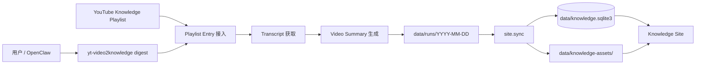
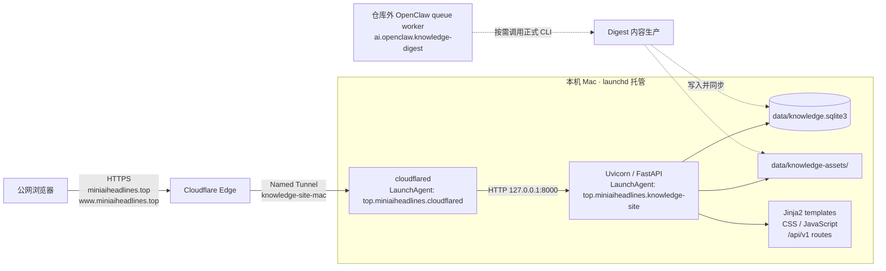
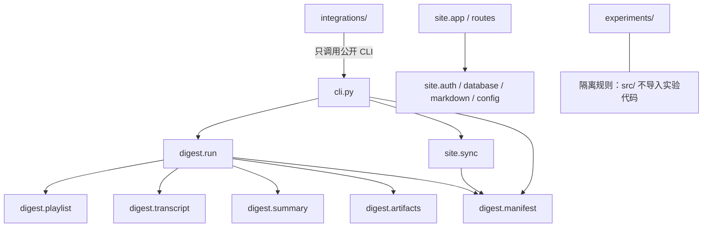

# 项目地图：一间标识清楚的工作室

这份地图同时写给人和 coding agent。它不要求你先理解所有 Python 代码，而是先回答几个更朴素的问题：

1. 原料从哪里来，最后变成什么？
2. 每个房间只负责哪一类工作？
3. 出现问题时，第一扇应该推开的门是哪一扇？

本文只画有架构意义的目录和文件。`.venv/`、`__pycache__/`、`.playwright-tmp/`、本机凭据、运行日志和临时工作文件可能真实存在，但它们不是项目结构，不应该成为理解代码的起点。

## 第一层：五分钟建立心智模型

### 一句话解释这个项目

这个项目是一条本地知识生产线：它把 YouTube Knowledge Playlist 中的视频变成可追溯的 Transcript 和中文 Video Summary，再把完成的内容同步到一个由本机 Mac 提供服务的 Knowledge Site。

如果一句话还太抽象，可以把它想成一间工作室：

| 房间 | 项目位置 | 它负责什么 | 什么时候进去 | 绝不能承担什么 |
| --- | --- | --- | --- | --- |
| 门厅与控制台 | 根目录 | 告诉人和 agent 项目是什么、如何安装、如何运行 | 第一次进入仓库或需要找入口时 | 放具体业务 implementation |
| 正式生产区 | `src/yt_video2knowledge/` | 运行真正的 Digest 和 Knowledge Site | 修改产品行为时 | 放实验脚本或历史方案 |
| 质检室 | `tests/` | 验证正式 module 和实验约束 | 修 bug、重构或变更行为时 | 复制一套生产 implementation |
| 正式配方架 | `prompts/production/` | 保存生产摘要实际使用的 prompt | 改模型输入规则时 | 混入未验证 prompt |
| 实验室 | `experiments/` | 比较 prompt、模型和原型 | 需要试错时 | 被 `src/` 反向依赖 |
| 对外装卸口 | `integrations/` | 让 OpenClaw 等外部系统接入正式 CLI | 修改外部 adapter 时 | 复制 Digest 业务逻辑 |
| 工具柜 | `tools/` | 安装和维护仓库周边能力 | 做一次性维护时 | 成为日常业务入口 |
| 手册与档案室 | `docs/` | 保存地图、运行手册、ADR 和历史材料 | 理解或操作系统时 | 保存运行状态和 secret |
| 仓库与账本 | `data/` | 保存本机运行状态、产物、SQLite 和资源 | 检查某次运行或站点数据时 | 放可复用源码 |

### 奥卡姆剃刀：找文件只问一个问题

你不需要先记住所有路径。先判断自己正在处理哪一种东西：

```text
产品行为？      -> src/
验证产品行为？  -> tests/
模型正式配方？  -> prompts/production/
尚未证实的尝试？-> experiments/
外部系统接入？  -> integrations/
维护动作？      -> tools/
知识与操作说明？-> docs/
运行结果或状态？-> data/
```

如果一个新文件同时像两三种东西，先不要新建更多目录。先把它的唯一职责说成一句话；说不清楚，通常说明边界还没想清楚。

### 内容生产图



最重要的分界线是：

- Digest 生产内容，结果以 `data/runs/` 和 manifest 为准。
- Site sync 把 Summary-ready Video 投影到 SQLite 和资源目录。
- Knowledge Site 消费已经同步的数据，不负责下载视频或生成摘要。

只想看现有内容时，不需要重新运行 Digest；只想生成摘要时，也不要求公网 Tunnel 在线。

## 当前部署图

Knowledge Site 不是云端应用。代码、数据库和 HTTP 服务都在这台 Mac 上，Cloudflare Tunnel 只提供公网入口。



图中有三个容易混淆的事实：

1. `cloudflared` 从本机主动建立出站 Tunnel；不需要把 Mac 的 8000 端口直接暴露到公网。
2. 前端不是 React、Vue 或 Vite 项目。FastAPI 同时提供 Jinja2 页面、`static/`、`/assets` 和站内 API，因此没有第三个前端进程。
3. OpenClaw queue worker 位于 `~/.openclaw/workspace/automation/knowledge-digest/`，负责调度长时间内容任务；它不是网站部署的一部分，也不是本仓库的 production module。

当前网站的两个常驻 LaunchAgent 是：

| 角色 | LaunchAgent label | 关键输入 | 日志 |
| --- | --- | --- | --- |
| FastAPI/Uvicorn | `top.miniaiheadlines.knowledge-site` | 仓库、`~/.config/knowledge-site/env` | `~/Library/Logs/knowledge-site/uvicorn.*.log` |
| Cloudflare connector | `top.miniaiheadlines.cloudflared` | `~/.config/knowledge-site/cloudflared-token` | `~/Library/Logs/knowledge-site/cloudflared.*.log` |

这些 plist 位于 `~/Library/LaunchAgents/`，属于本机部署状态，不在仓库中版本化。

## 第二层：精确目录与 module 参考

### 当前有效目录树

```text
yt-video2knowledge/
├── README.md                 # 给人的完整使用说明
├── SKILL.md                  # 给 agent 的仓库执行契约
├── CONTEXT.md                # domain 语言与概念边界
├── CLAUDE.md                 # coding agent 仓库规则
├── AGENTS.md -> CLAUDE.md    # 同一规则的兼容入口
├── metadata.json             # Skill 元数据
├── pyproject.toml            # package、依赖和 CLI 声明
├── uv.lock                   # 可重复 Python 依赖锁
├── Brewfile                  # macOS 系统工具依赖
├── src/
│   └── yt_video2knowledge/
│       ├── cli.py
│       ├── paths.py
│       ├── digest/
│       │   ├── config.py
│       │   ├── errors.py
│       │   ├── run.py
│       │   ├── manifest.py
│       │   ├── playlist.py
│       │   ├── transcript.py
│       │   ├── summary.py
│       │   └── artifacts.py
│       └── site/
│           ├── app.py
│           ├── config.py
│           ├── database.py
│           ├── auth.py
│           ├── markdown.py
│           ├── sync.py
│           ├── routes/
│           ├── templates/
│           └── static/
├── tests/
│   ├── digest/
│   ├── site/
│   ├── experiments/
│   └── test_cli.py
├── prompts/production/
├── experiments/summary-prompt-v1/
├── integrations/openclaw/youtube-ai-digest/
├── tools/install_openclaw_skill.sh
├── docs/
│   ├── guides/
│   ├── operations/
│   ├── adr/
│   ├── agents/
│   └── archive/
└── data/
```

这是“架构树”，不是 `find` 命令的逐字输出。被忽略的本机缓存、浏览器 profile、运行日志和凭据仍可能存在，但不应该被 coding agent 当作可提交的 architecture。

### 根目录：控制台而不是生产区

| 文件 | 作用 | 给谁看 |
| --- | --- | --- |
| `README.md` | 安装、依赖、实际工作流和常见问题 | 人 |
| `SKILL.md` | 触发条件、默认路径、OpenClaw 行为和结果汇报 | agent |
| `CONTEXT.md` | Playlist Entry、Target Date、Digest Run 等统一 domain 词汇 | 人和 agent |
| `CLAUDE.md` / `AGENTS.md` | 同一份 coding agent 根约束；`AGENTS.md` 是指向 `CLAUDE.md` 的符号链接 | agent |
| `pyproject.toml` | distribution、依赖、Hatchling 和 CLI entry point | Python/uv |
| `uv.lock` | 锁定 Python 依赖的精确版本 | uv |
| `Brewfile` | 声明 `uv`、`yt-dlp`、`ffmpeg` 等系统工具 | Homebrew |
| `.env.local.example` | 非敏感环境变量示例 | 人 |
| `metadata.json` | Skill 名称、版本、依赖和触发元数据 | agent tooling |

原则：根目录只保留入口、契约和环境声明。业务逻辑进入 `src/`，产物进入 `data/`。

### `digest/`：把视频变成知识内容

| module | 唯一职责 |
| --- | --- |
| `run.py` | 编排一次 Digest Run，不重复实现下层策略 |
| `playlist.py` | 获取和标准化 Playlist Entry，处理严格日期与浏览器/API 接入 |
| `transcript.py` | 字幕优先、音频回退、MLX Whisper、诊断和清理 |
| `summary.py` | provider 路由、摘要生成、结构校验和有限重试 |
| `manifest.py` | Digest Run manifest、完成判断、恢复和索引 |
| `artifacts.py` | 写入单视频 metadata、Transcript 和 Video Summary 产物 |
| `config.py` | Digest 配置、常量、日期和 JSON 辅助逻辑 |
| `errors.py` | 可诊断的 Digest 异常类型 |

Manifest 是一次 Digest Run 是否完成的权威记录。进程退出码有用，但不能代替 `failed_count` 与 `pending_summary_count`。

### `site/`：把知识内容变成可阅读网站

| module/目录 | 唯一职责 |
| --- | --- |
| `app.py` | 创建 FastAPI app，挂载 middleware、静态资源和 routes |
| `sync.py` | 从 `data/runs/` 导入 Summary-ready Video、SQLite 和资源 |
| `config.py` | 站点环境变量与数据路径 |
| `database.py` | SQLite schema 初始化和连接 |
| `auth.py` | 登录 session 与 route 权限检查 |
| `markdown.py` | 把 Video Summary 解析为页面可用的结构化 block |
| `routes/pages.py` | 登录页、首页、日期页和视频页 |
| `routes/api_v1.py` | 读取和保存 Meta Summary 的站内 API |
| `templates/` | 服务端渲染 HTML |
| `static/` | 浏览器端 CSS 和 JavaScript |

Knowledge Site 当前提供的站内 API 是：

```text
GET /api/v1/videos/{video_id}/meta-summary
PUT /api/v1/videos/{video_id}/meta-summary
```

它们依赖登录 session，只管理 Meta Summary，不生成 Video Summary。

### 正式 module 依赖方向



依赖只向下流动：下层 domain module 不反向导入 `run.py` 或 `cli.py`；`src/` 不导入 `experiments/`；外部 adapter 调用正式入口，不复制业务规则。

### `tests/`：与正式边界对齐的质检室

| 测试位置 | 主要验证内容 |
| --- | --- |
| `tests/digest/test_workflow.py` | Playlist、Transcript、Summary retry、manifest、恢复与增量合并 |
| `tests/site/test_sync.py` | Digest 产物到 SQLite/assets 的同步 |
| `tests/site/test_routes.py` | 登录、页面、Meta Summary API 和 Markdown block |
| `tests/test_cli.py` | 子命令参数、退出码、自动同步和失败语义 |
| `tests/experiments/` | prompt registry 与实验/生产隔离约束 |

测试直接导入正式 package，不修改 `sys.path`，也不依赖已经删除的脚本式入口。

## 想改什么，先去哪里

| 目标或现象 | 第一检查点 | 第二检查点 |
| --- | --- | --- |
| Playlist 日期或命中数量错误 | `digest/playlist.py` | `data/runs/.../manifest.json` |
| 字幕、音频或转写失败 | `digest/transcript.py` | 单视频 `metadata.json` 与诊断目录 |
| 模型调用、摘要校验或重试失败 | `digest/summary.py` | manifest 中的 `summary_retry` |
| 整批完成状态或恢复错误 | `digest/manifest.py` | `digest/run.py` |
| CLI 参数或退出码错误 | `cli.py` | `tests/test_cli.py` |
| 网站没有新日期或视频 | `site/sync.py` | SQLite 与目标日期 manifest |
| 登录或 cookie 异常 | `site/auth.py`、`site/config.py` | LaunchAgent 环境变量来源 |
| 页面渲染或 Markdown 层级错误 | `site/markdown.py`、`templates/` | `static/` 与 route 测试 |
| 本机正常、公网失败 | `cloudflared` LaunchAgent | Cloudflare Tunnel / Published application |
| OpenClaw 任务未开始 | 仓库外 queue/worker status | `ai.openclaw.knowledge-digest` LaunchAgent |

## 命令与操作入口

项目地图只描述结构，不复制容易漂移的命令和操作规则：

| 需要做什么 | 唯一入口 |
| --- | --- |
| 查看开发、测试和常用 CLI | 根 `CLAUDE.md` / `AGENTS.md` 与 [`README.md`](../../README.md) |
| 执行 Digest 或恢复任务 | 仓库 [`SKILL.md`](../../SKILL.md) 与真实 CLI `--help` |
| 修改或浏览器验收 Knowledge Site | [Site 变更与浏览器验收规则](../agents/knowledge-site-validation.md) |
| 操作网站服务或 Tunnel | [Agent 部署规则](../agents/knowledge-site-deployment.md) 与 [当前运行手册](../operations/knowledge-site-deployment.md) |
| 查阅历史事故和旧方案 | [`docs/archive/`](../archive/)；不得作为当前操作依据 |

## 继续阅读

- [Knowledge Site 当前部署运行手册](../operations/knowledge-site-deployment.md)
- [Cloudflare Tunnel 与 Published application 配置](../operations/cloudflare-public-hostname.md)
- [Knowledge Site 变更与浏览器验收规则](../agents/knowledge-site-validation.md)
- [coding agent 的 Knowledge Site 部署规则](../agents/knowledge-site-deployment.md)
- [OpenClaw 视频恢复复盘（历史）](../archive/openclaw-recovery.md)
- [Architecture Decision Records](../adr/README.md)
- [根目录 README](../../README.md)
- [仓库 Skill](../../SKILL.md)
