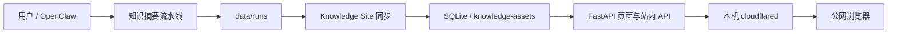

# 用户交流核心知识

本文是用户与 AI coding agent 交流这个项目时的第一张“项目地图”。它主要回答四个问题：

1. 这个项目由哪些板块组成？
2. 日常恢复网站时到底要启动什么？
3. 出现问题时，应该先检查哪一层？
4. 怎样向 AI coding agent 描述任务，才能让它快速定位问题？

这里只保留核心概念、常用命令和排障入口。首次配置、Cloudflare 后台操作等详细步骤，请继续阅读文末链接的专项文档。

## 先纠正一个最重要的认识

Knowledge Site 可以从概念上分成三个层面：

1. **FastAPI 后端**：处理登录、读取数据库、生成页面，并提供站内 API。
2. **浏览器前端**：Jinja2 模板、CSS 和 JavaScript，负责展示日报、视频摘要和编辑 Meta Summary。
3. **Cloudflare 公网入口**：把公网域名的请求转发到本机服务。

但是，**三个概念层不等于三个常驻进程**。

日常恢复 Knowledge Site 时，只需要维持两个核心进程：

```text
Uvicorn / FastAPI  -> 监听本机 127.0.0.1:8000
cloudflared        -> 把公网请求转发到 127.0.0.1:8000
```

前端不是独立的 React、Vue 或 Vite 项目，没有单独的开发服务器，也不需要第三条启动命令。FastAPI/Uvicorn 会同时提供：

- 服务端渲染的 HTML 页面；
- `knowledge_site/static/` 中的 CSS 和 JavaScript；
- `/api/v1/...` 站内 API；
- `data/knowledge-assets/` 中同步后的缩略图等资源。

因此，公网访问的实际链路是：

```text
公网浏览器
  -> https://miniaiheadlines.top
  -> Cloudflare
  -> 本机 cloudflared
  -> http://127.0.0.1:8000
  -> FastAPI 页面、静态资源和站内 API
```

## 整个项目的数据流

这个仓库不只是一个网站。它还负责从 YouTube 生成知识内容，再把内容同步到网站数据库。



可以把它理解为两个相对独立的系统：

- **内容生产系统**：读取 YouTube 播放列表、获取字幕或转写音频、调用模型生成摘要，最终写入 `data/runs/`。
- **内容展示系统**：把 `data/runs/` 同步到 SQLite 和资源目录，再通过 Knowledge Site 展示。

只想浏览已经同步的内容时，不需要重新运行视频处理流水线。只想生成新摘要时，也不要求公网 Tunnel 必须在线。

## 四个核心板块

### 1. 内容生成流水线

主要入口：

```text
scripts/run_knowledge_digest.py
```

它负责：

- 查询 `knowledge` 播放列表；
- 用 YouTube Data API 判断视频加入播放列表的日期；
- 用 `yt-dlp` 获取视频信息、字幕或音频；
- 必要时用 `mlx-whisper` 本地转写；
- 调用 OpenAI-compatible Responses API 生成中文摘要；
- 把结果写入 `data/runs/YYYY-MM-DD/`；
- 正常内容任务结束后，自动同步该日期到 Knowledge Site。

最值得检查的运行结果：

```text
data/runs/YYYY-MM-DD/manifest.json
data/runs/YYYY-MM-DD/daily-overview.zh-CN.md
data/runs/YYYY-MM-DD/videos/<video-id>/metadata.json
data/runs/YYYY-MM-DD/videos/<video-id>/summary.zh-CN.md
```

`manifest.json` 是判断整批任务是否完成的主要依据。单个视频的问题则优先看该视频的 `metadata.json`。

### 2. Knowledge Site 数据同步

主要入口：

```text
scripts/sync_knowledge_site.py
knowledge_site/sync.py
```

同步过程会把 `data/runs/` 中已经完成的日报和视频摘要写入：

```text
data/knowledge.sqlite3
data/knowledge-assets/
```

同步是一次性命令，不是需要长期保持的第三个进程。

正常执行 `scripts/run_knowledge_digest.py` 时，目标日期会自动同步。只有在手动修改了运行产物、修复旧数据或自动同步失败时，才需要单独运行同步命令。

### 3. Knowledge Site

主要目录：

```text
knowledge_site/
```

关键职责：

- `main.py`：创建 FastAPI 应用，挂载静态资源和路由；
- `routes/pages.py`：登录页、首页、日期页和视频页；
- `routes/api_v1.py`：Meta Summary 站内 API；
- `templates/`：服务端渲染的 HTML；
- `static/`：浏览器端 CSS 和 JavaScript；
- `database.py`：SQLite 初始化和连接；
- `config.py`：环境变量与数据路径。

Knowledge Site 启动时必须存在：

```text
KNOWLEDGE_SITE_PASSWORD
KNOWLEDGE_SITE_SECRET_KEY
```

固定域名部署时还建议设置：

```text
KNOWLEDGE_SITE_COOKIE_DOMAIN='.miniaiheadlines.top'
```

这些真实值应保存在仓库外，例如 `~/.config/knowledge-site/env`。

### 4. Cloudflare 公网接入

当前固定公网入口：

```text
https://miniaiheadlines.top
https://www.miniaiheadlines.top
```

当前 Named Tunnel：

```text
knowledge-site-mac
```

两个 Public Hostname 最终都转发到：

```text
http://127.0.0.1:8000
```

Cloudflare Tunnel 不会把应用部署到云端。FastAPI 和 `cloudflared` 仍然运行在这台 Mac 上，因此 Mac 关机、断网、FastAPI 停止或 `cloudflared` 停止时，公网域名都会不可用。

## 两套容易混淆的 API

### OpenAI-compatible Responses API

内容生成流水线会**向外部服务发出请求**：

```text
/v1/responses
```

它的用途是把 transcript 生成中文视频摘要和日报。这个 API 不由本仓库的 FastAPI 提供。

相关问题通常从下面几处入手：

- `.env.local` 中的 `OPENAI_BASE_URL`、`OPENAI_API_KEY`、`OPENAI_MODEL`；
- `scripts/knowledge_digest.py`；
- `data/runs/YYYY-MM-DD/manifest.json`；
- 单视频 `metadata.json` 中的总结状态和错误。

### Knowledge Site 站内 API

本仓库 FastAPI 当前提供的站内 API 是：

```text
GET /api/v1/videos/{video_id}/meta-summary
PUT /api/v1/videos/{video_id}/meta-summary
```

它由视频页中的浏览器 JavaScript 调用，用来读取和保存 Meta Summary，并依赖当前登录 session。

AI coding agent 通常通过仓库 CLI、根目录 `SKILL.md` 或 OpenClaw 队列操作项目，而不是通过这两个站内 API 生成知识摘要。

## 场景一：只恢复网站访问

### 1. 先检查现有状态

不要在未检查的情况下重复启动或强制杀进程：

```bash
lsof -nP -iTCP:8000 -sTCP:LISTEN || true
pgrep -x cloudflared || true
screen -ls | sed -n '/knowledge-site/p' || true
```

如果 `127.0.0.1:8000` 已经有一个健康的监听进程，并且 Named Tunnel 也正常，就不需要重复启动。

### 2. 启动 FastAPI/Uvicorn

在仓库根目录运行：

```bash
cd /Users/administrator/projects/yt-video2knowledge
set -a
source ~/.config/knowledge-site/env
set +a
.venv/bin/uvicorn knowledge_site.main:create_app --factory --host 127.0.0.1 --port 8000
```

如果没有使用持久化进程管理器，这个终端需要保持打开。

### 3. 启动 Named Tunnel

在另一个终端中，从 Cloudflare Dashboard 取得 connector token 后，用隐藏输入启动：

```bash
read -s TUNNEL_TOKEN
export TUNNEL_TOKEN
cloudflared tunnel run
unset TUNNEL_TOKEN
```

不要把 token 直接写进命令、文档或仓库。

### 4. 验证本机和公网

验证应用时使用 `GET`，不要用 `HEAD`。当前应用对 `HEAD /` 可能返回 `405`。

```bash
curl -sS -o /tmp/knowledge-site-local.html -w '%{http_code}\n' --max-time 5 http://127.0.0.1:8000/
curl -sS -o /tmp/knowledge-site-root.html -w '%{http_code}\n' --max-time 10 https://miniaiheadlines.top/
curl -sS -o /tmp/knowledge-site-www.html -w '%{http_code}\n' --max-time 10 https://www.miniaiheadlines.top/
```

未登录时返回 `303` 并跳转到登录页是正常结果，不代表服务异常。

## 场景二：生成并发布新内容

处理指定日期：

```bash
uv run python scripts/run_knowledge_digest.py --target-date YYYY-MM-DD
```

正常内容任务完成后，会自动把该日期同步到 Knowledge Site。需要手动重做同步时运行：

```bash
uv run python scripts/sync_knowledge_site.py --target-date YYYY-MM-DD
```

需要重建所有历史日期的站点数据时，才运行不带日期的完整同步：

```bash
uv run python scripts/sync_knowledge_site.py
```

重新同步数据通常不需要重启 Uvicorn 或 `cloudflared`。如果改动的是 Python 应用代码或部署配置，则应按部署规则检查现有状态并有控制地重启对应进程。

## 场景三：通过 OpenClaw 运行内容任务

OpenClaw 的完整日期任务优先进入本地队列，避免长时间下载、转写和总结被聊天会话超时打断。

排队一个日期：

```bash
python3 /Users/administrator/.openclaw/workspace/automation/knowledge-digest/queue_request.py YYYY-MM-DD --requested-by openclaw --note "knowledge digest"
```

查看队列和 worker 状态：

```bash
python3 /Users/administrator/.openclaw/workspace/automation/knowledge-digest/show_status.py
```

这里的本地队列 worker 属于**内容生产系统**：

- 需要无人值守处理视频时，它才需要正常工作；
- 只浏览已经同步的网站时，不需要启动它；
- 它不是 Knowledge Site 所谓的“第三个前端进程”；
- worker 正在运行时，不要用强制 kickstart 打断它，应先检查状态。

## 按现象决定从哪里排查

| 现象 | 第一检查点 | 继续检查 |
| --- | --- | --- |
| 本机 `127.0.0.1:8000` 打不开 | Uvicorn 是否监听 8000 | 站点环境变量、启动日志、`knowledge_site/main.py` |
| 本机正常，公网打不开或返回 Cloudflare 530 | 本机 `cloudflared` 是否运行 | Tunnel 健康状态、Public Hostname、Cloudflare DNS |
| 网站能打开，但没有新日期或新视频 | `data/runs/YYYY-MM-DD/manifest.json` | 同步命令输出、`data/knowledge.sqlite3`、`knowledge_site/sync.py` |
| Meta Summary 保存失败 | 浏览器是否仍处于登录状态 | `/api/v1/...` 响应、`static/site.js`、SQLite 写入 |
| 中文摘要生成失败 | 单视频 `metadata.json` 和 `manifest.json` | OpenAI-compatible 环境变量、证书、`/v1/responses` 支持情况 |
| 视频日期不正确或命中 0 条 | YouTube API 返回的 `playlist_added_date` | OAuth token、目标时区、是否明确允许 first-seen 回退 |
| 字幕获取或本地转写失败 | 单视频 transcript 状态 | 浏览器 profile、`yt-dlp`、音频文件、`mlx-whisper` |
| 登录频繁失效 | `KNOWLEDGE_SITE_SECRET_KEY` 是否保持固定 | cookie domain、根域名与 `www` 是否混用、浏览器 cookie |
| OpenClaw 任务没有开始 | 队列和 worker 状态 | launchd 状态、worker lock；不要直接强制重启运行中的 worker |

排障时应从用户能观察到的最靠近一端开始：

```text
公网不通：本机 FastAPI -> 本机 cloudflared -> Cloudflare Tunnel -> DNS
内容缺失：data/runs -> sync -> SQLite -> 页面查询
摘要失败：transcript -> Responses API -> manifest -> sync
页面保存失败：登录 session -> 浏览器请求 -> 站内 API -> SQLite
```

## 怎样向 AI coding agent 描述任务

一次有效的任务描述最好包含：

```text
目标板块：
可观察到的现象：
访问入口或目标日期：
已经执行的命令：
完整错误信息或 HTTP 状态码：
希望达到的最终状态：
是否允许重启服务：
是否需要保持公网持续可用：
```

不要只说“网站坏了”或“帮我重启”。更好的说法是：

- “本机 `GET http://127.0.0.1:8000/` 返回 303，但公网域名返回 530。请只诊断 Cloudflare Tunnel 链路，先不要重启 FastAPI。”
- “`2026-07-26` 的 `manifest.json` 显示摘要已完成，但网站没有这一天。请检查同步链路，不要重新下载或转写视频。”
- “视频页能打开，但点击保存 Meta Summary 显示保存失败。请检查登录 session、`PUT /api/v1/videos/{video_id}/meta-summary` 和 SQLite 写入。”
- “请处理 `YYYY-MM-DD` 的 knowledge 播放列表任务。已有 transcript 时优先补跑摘要，不要默认全量重跑。”
- “请恢复公网 Knowledge Site。操作前先检查 8000 监听、`cloudflared` 和 screen 会话；完成后报告本机与公网的 GET 状态码。”

如果希望 agent 修改代码，还应明确：

- 只诊断，还是允许实现修复；
- 是否允许启动、停止或重启现有服务；
- 是否允许操作 Cloudflare Dashboard；
- 最终应让服务保持运行还是保持停止；
- 哪些当前未提交改动不能触碰。

## 安全边界

下面这些内容不得写入仓库文档、聊天消息、最终回复或可被提交的文件：

- `KNOWLEDGE_SITE_PASSWORD` 的真实值；
- `KNOWLEDGE_SITE_SECRET_KEY` 的真实值；
- Cloudflare connector token；
- `OPENAI_API_KEY`；
- Google OAuth client secret 和 OAuth token；
- YouTube 或浏览器 cookies。

让 AI coding agent 检查配置时，只报告变量是 `present` 还是 `missing`，不要打印变量内容。需要输入 Cloudflare token 或登录密码时，优先由用户在终端或浏览器中亲自输入。

停止进程时不要使用宽泛的 `pkill -f`、`pgrep -f` 或模糊字符串匹配。应先精确确认 8000 监听进程和进程名为 `cloudflared` 的 connector，避免误伤其他工具或会话。

## 详细文档入口

- [README：内容生成流水线、依赖和常见错误](README.md)
- [Knowledge Site 当前部署使用说明](docs/knowledge-site-deployment-usage.md)
- [Cloudflare 固定域名与 Named Tunnel 说明](docs/cloudflare-public-hostname-miniaiheadlines.md)
- [AI agent 操作 Knowledge Site 的部署规则](docs/agent-instructions/knowledge-site-deployment.md)
- [仓库内 Skill 执行说明](SKILL.md)
